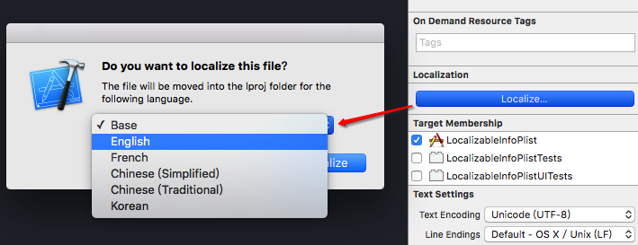

# react-native-keyboardmanager


### Usage

##### Step 1 - install
```
npm install react-native-keyboardmanager --save  || yarn add react-native-keyboardmanager
```

##### Step 2 - link
```
react-native link
```

##### Step 3 - import and use in project

AppDelegate 导入
```
#import <IQKeyboardManager.h>
```

##### Step 4 - 在didFinishLaunchingWithOptions导入下面三句代码:
```
[[IQKeyboardManager sharedManager] setEnable:YES];
[IQKeyboardManager sharedManager].shouldResignOnTouchOutside = YES;
[[IQKeyboardManager sharedManager] setKeyboardDistanceFromTextField:10.f];
```
### 设置多语言

#### Step 1 配置需要国际化的语言
```
选中project->Info->Localizations，然后点击"+"，添加需要国际化/本地化的语言，如下图（默认需要勾选Use Base Internationalization）：
```

```
此处以添加法语为例，如下图
```

```
弹出如下对话框，直接点击finish，如下图：
```

```
同理，添加简体中文、繁体中文、韩语，最终结果如下图：
```


#### Step 2 字符串本地化
```
首先需要command + N，选择iOS -> Resource -> Strings File
```

```
文件名必须命名为Localizable
备注：因本人电脑取消隐藏文件后缀名，所以会自动补全.strings后缀名。
```

```
文件创建成功，查看Xcode左侧导航列表，发现多了一个名为Localizable.strings的文件，如下图：
```

```
选中Localizable.strings文件，在Xcode的File inspection中点击Localize，目的是选择我们需要本地化的语言（和本地化App名称同理），如下图：
```

```
依次选择English->Localize，如下图：
```


```
然后我们发现Xcode右侧的File inspection变成了下图的样式：
```

```
然后勾选French、Chinese（zh-Hans）、Chinese（zh-Hant）、Korean，如下图：
```

```
此时，Xcode左侧的Localizable.stirings左侧多了一个箭头，展开后，如下图所示：
```

```
然后我们只需要在Localizable.strings下对应的文件中，分别以Key-Value的形式，为代码中每一个需要本地化的字符串赋值，如下图：
```


```
本地化代码中的字符串，如下图：
```


### Manual installation
```
首先，我们在创建的ReactNative工程下的node_modules创建一个文件夹react-native-BGNativeModuleExample，然后我们在新创建的文件夹下再创建一个ios文件夹。

$ cd TestProject/node_modules
$ mkdir react-native-BGNativeModuleExample
$ cd react-native-BGNativeModuleExample
$ mkdir ios
然后，由于ReactNative的组件都是一个个静态库，我们发布到npm给别人使用的话，也需要建立静态库。我们使用xcode建立静态库，取名为BGNativeModuleExample。建立之后，我们将创建的静态库中的文件全部copy到node_modules/react-native-BGNativeModuleExample/ios目录下。
ios文件目录如下：

|____BGNativeModuleExample
| |____BGNativeModuleExample.h
| |____BGNativeModuleExample.m
|____BGNativeModuleExample.xcodeproj
最后，我们需要手动将这个静态库链接到工程中
```
1、使用xcode打开创建的静态库，添加一行Header Search Paths，值为$(SRCROOT)/../../react-native/React，并设置为recursive。
 

2、将BGNativeModuleExample静态库工程拖动到工程中的Library中。

 

3、选中 TARGETS => TestProject => Build Settings => Link Binary With Libraries，添加libBGNativeModuleExample.a这个静态库

 


4.不是所有的库都需要进行这个步骤，你需要考虑的问题在于：

我需要在编译的期间了解库的内容吗？

这个问题的意思是，你是需要在原生代码中使用这个库，还是只需要通过JavaScript访问？如果你只需要通过JavaScript访问这个库，你就可以跳过这步了。

这一步骤对于我们随React Native发布的大部分库来说都不是必要的，但有两个例外是PushNotificationIOS和LinkingIOS。

以PushNotificationIOS为例，你需要在AppDelegate每收到一条推送通知之后，调用库中的一个方法。

这种情况下我们需要能够访问到库的头文件。为了能够顺利打包，你需要打开你的工程文件，选择Build Settings，然后搜索Header Search Paths，然后添加库所在的目录（如果它还有像React这样的子目录需要包含，注意要选中recursive选项）
到此，我们准备工作完成了。我们这里这么准备是有用意的，那就是模拟npm链接的过程，建立好了环境，避免了发布到npm上后别人使用找不到静态库的问题。

 


### 发布上线
```
我们按照上面步骤编写好原生模块之后，接下来将我们写的原生模块发布到npm。
```
###### 1、我们需要创建github仓库
```
在github上创建一个仓库react-native-BGNativeModuleExample，然后关联到我们前面创建的react-native-BGNativeModuleExample目录

$ cd TestProject/node_modules/react-native-BGNativeModuleExample
$ git init .
$ git remote add origin https://github.com/liuchungui/react-native-BGNativeModuleExample.git
```
###### 2、我们需要创建原生模块的入口文件
```
我们需要在react-native-BGNativeModuleExample目录下创建一个index.js，它是整个原生模块的入口，我们这里只是将原生进行导出。

//index.js
import React, { NativeModules } from 'react-native';
module.exports = NativeModules.BGNativeModuleExample;
```
###### 3、发布到npm
```
在发布到npm之前，我们需要创建一个package.json文件，这个文件包含了module的所有信息，比如名称、版本、描述、依赖、作者、license等。
我们在react-native-BGNativeModuleExample根目录下使用npm init命令来创建package.json，系统会提示我们输入所需的信息，不想输入的直接按下Enter跳过。

$ npm init
This utility will walk you through creating a package.json file.
It only covers the most common items, and tries to guess sensible defaults.
See `npm help json` for definitive documentation on these fields
and exactly what they do.
Use `npm install <pkg> --save` afterwards to install a package and
save it as a dependency in the package.json file.
Press ^C at any time to quit.
name: (react-native-BGNativeModuleExample)
输入完成之后，系统会要我们确认文件的内容是否有误，如果没有问题直接输入yes，那么package.json就创建好了。
我这里创建的package.json文件如下：

{
  "name": "react-native-nativemodule-example",
  "version": "1.0.0",
  "description": "",
  "main": "index.js",
  "scripts": {
    "test": "echo \"Error: no test specified\" && exit 1"
  },
  "repository": {
    "type": "git",
    "url": "git+https://github.com/liuchungui/react-native-BGNativeModuleExample.git"
  },
  "author": "",
  "license": "ISC",
  "bugs": {
    "url": "https://github.com/liuchungui/react-native-BGNativeModuleExample/issues"
  },
  "homepage": "https://github.com/liuchungui/react-native-BGNativeModuleExample#readme"
}
如果我们编写的原生模块依赖于其他的原生模块，我们需要在package.json添加依赖关系，我们这里由于没有相关依赖，所以不需要添加：

"dependencies": {
}
初始化完package.json，我们就可以发布到npm上面了。

如果没有npm的账号，我们需要注册一个账号，这个账号会被添加到npm本地的配置中，用来发布module用。

$ npm adduser   
Username: your name
Password: your password
Email: yourmail@gmail.com
成功之后，npm会把认证信息存储在~/.npmrc中，并且可以通过以下命令查看npm当前使用的用户：

$ npm whoami
以上完成之后，我们就可以进行发布了。

$npm publish
+ react-native-nativemodule-example@1.0.0
到这里，我们已经成功把module发布到了npmjs.org。当然，我们也别忘记将我们的代码发布到github。

$ git pull origin master
$ git add .
$ git commit -m 'add Project'
$ git push origin master
有时候，有些文件没必要发布，例如Example文件，我们就可以通过.npmignore忽略它。例如我这里.npmignore文件内容如下：

Example/
.git
.gitignore
.idea
这样的话，我们npm进行发布的时候，就不会将Example发布到npm上了。

```
###### 4、添加Example，测试是否可用，添加README
```
我们在react-native-BGNativeModuleExample目录下创建一个Example的ReactNative工程，并且通过rnpm install react-native-nativemodule-example命令安装我们发布的react-native-nativemodule-example模块。

$ rnpm install react-native-nativemodule-example
TestProject@0.0.1 /Users/user/github/TestProject
└── react-native-nativemodule-example@1.0.0 
rnpm-link info Linking react-native-nativemodule-example ios dependency 
rnpm-link info iOS module react-native-nativemodule-example has been successfully linked 
rnpm-link info Module react-native-nativemodule-example has been successfully installed & linked
上面提示安装并且link成功，我们就可以在js中进行使用了。

import BGNativeModuleExample from 'react-native-nativemodule-example';
BGNativeModuleExample.testPrint("Jack", {
    height: '1.78m',
    weight: '7kg'
});
```
###### 5、我们在发布上线之后还需要编写README文件。
```
README文件是非常重要的，如果没有README文件，别人看到我们的原生组件，根本就不知道我们这个组件是用来干啥的。所以，我们很有必要添加一个README文件，这个文件需要告诉别人我们这个原生组件是干什么的、如何安装、API、使用手册等等。

```
###### 6、原生模块升级，发布新版本
```
当我们添加新代码或者修复bug后，需要发布新的版本，我们只需要修改package.json文件中的version的值就行了，然后使用npm publish进行发布。


